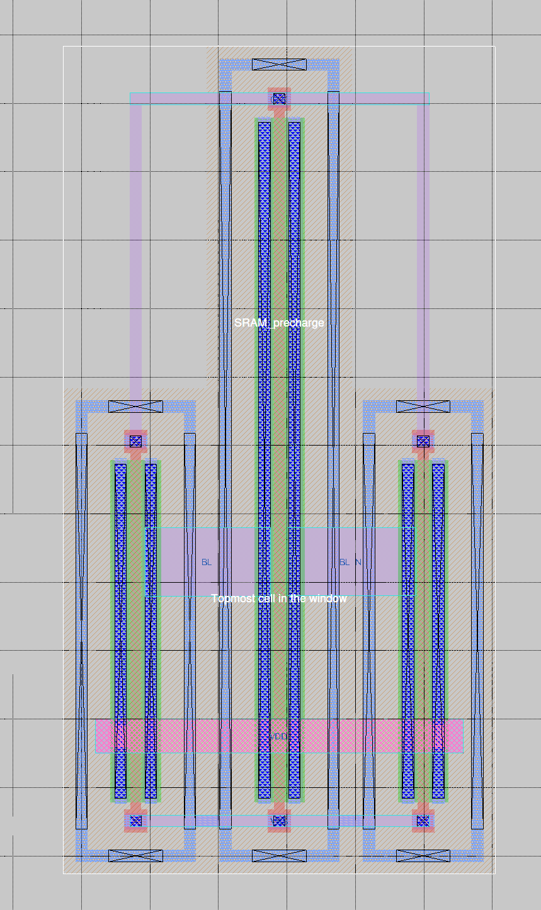

# SRAM Precharge 

## Table of Contents

- [Project Overview](#project-overview)
- [Workflow](#workflow)
- [Circuit Design](#circuit-design)
- [Spice Validation](#spice-validation)
- [Layout](#layout)
- [Post-Silicon Validation](#post-silicon-validation)
- [Resources](#resources)

## Project Overview

This project's goal is to design and implement the precharge circuitry needed for an SRAM memory array. The circuit's main goal is to drive the bitlines to a known reference voltage prior to a read or write operation, allowing sense amps to reliably read voltage changes with minimal offset or noise. This circuit is one component in a wider RAM architecture, with other teams working on the bit cells, address decoders, and sense amplifiers. As such, this circuit supports 4-CMOS and 2-NMOS bit cells.

## Workflow

This project borrows heavily from the UW ASIC design team workflow. We opted for this approach as it was already in use and tested thoroughly. The design utilized the SkyWater SKY130 PDK, an open-source process design kit that provides device models, standard cell libraries, and layout design rules.  

We used Xschem for schematic capture and running simulations with ngspice.

To validate our design, we used ngspice to perform transient and DC simulations. For physical layout, we used Magic VLSI to convert our schematics into a manufacturable layout. 


## Circuit Design

Two different circuit topologies were tested, traditional clocked NMOS according to textbook advice and experimental transmission gate based topology.

For transmission gate, complementary gates were sized 3 um for PFET and 2 um for NFET to account for mobility differences between each FET, per device physics. This enabled symmetrical pulling up and down of the bitlines relative to Vdd/2

Problems: voltage spike due to charge injection, however differential values do not fluctuate

Testing showed that the equalization transistor in the middle determined speed, and precharge transistors determined circuit behaviour with bitcell
## Spice Validation

Ran speed checks
Ran different cases of initial conditions
Ran PVT corners
Tested with 6T and 4T bitcells, NMOS was far more stable and passed Monte Carlo simulation with flying colors, hitting 500mV differential target easily within allocated time (less than 7.5ns or half a clock cycle)

Transmission gate was tested, but classical method was favoured over simplicity, and area/pin requirements


## Layout
<div style="display: flex; align-items: flex-start;">
   
   <div>
   <p>
   The layout uses 3 SKY130 NFET transistors: 1 10μm x 0.15μm and 2 5μm x 0.15μm mosfets. These device sizes were chosen through testing and simulations done in ngspice to determine optimal lengths that would ///. The footprint of the circuit is 6.310μm x 12.100μm (76.351 μm²).  
   
   To ensure that the layout would be manufacturable and avoid fabrication errors, we verified it using Design Rule Checks (DRC). This step ensures that all drawn geometries satisfy the SKY130 process constraints, such as minimum spacing and contact overlaps. 

   Once the layout passed DRC, we performed Layout vs Schematic (LVS) checks. LVS compares the extracted netlist from the layout with the original schematic to ensure that both represent the same circuit. This step verifies that all circuit components were replicated correctly in the layout, and ensures that no shorts or open circuits were introduced during the layout step.

   Finally, we generated a Spice netlist from the layout. This allows us to simulate the effects of parasitics on the final layout and get a better idea of how the circuit will perform in the real world. To extract the Spice netlist, we ran the following commands:
   </p>
   </div>
</div>

```
:extract all
:ext2spice cthresh 0
:ext2spice format ngspice
:ext2spice
```

The magic files, along with GDS and generated Spice files can be found in the `/analog/layout folder`.

## Post-Silicon Validation

## Resources

- [TinyTapeout Documentation](https://tinytapeout.com/)
- [OpenLane2 Documentation](https://openlane2.readthedocs.io/)
- [Sky130 PDK Documentation](https://skywater-pdk.readthedocs.io/)
- [Xschem Documentation](http://repo.hu/projects/xschem/)
- [Magic VLSI Documentation](http://opencircuitdesign.com/magic/)
- [Efabless Platform](https://platform.efabless.com/)
