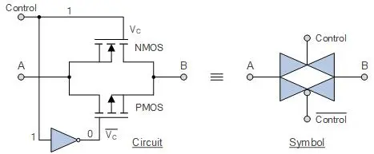
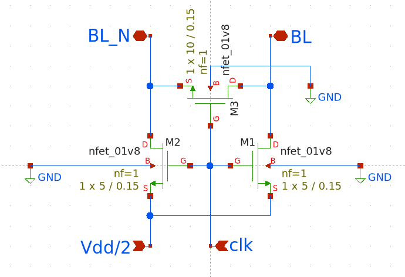
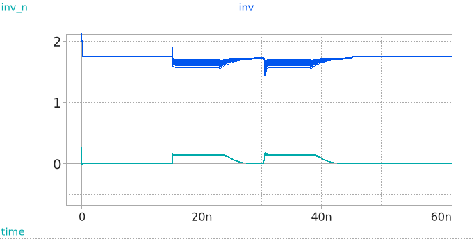
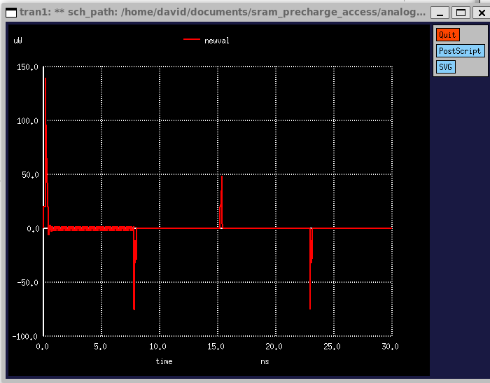

# SRAM Precharge 

## Table of Contents

- [SRAM Precharge](#sram-precharge)
  - [Table of Contents](#table-of-contents)
  - [Project Overview](#project-overview)
  - [Workflow](#workflow)
  - [Circuit Design](#circuit-design)
  - [Spice Validation](#spice-validation)
    - [Power Draw](#power-draw)
    - [Assumptions and Next Steps](#assumptions-and-next-steps)
  - [Layout](#layout)
  - [Post-Silicon Validation](#post-silicon-validation)
  - [Resources](#resources)

## Project Overview

This project's goal is to design and implement the precharge circuitry needed for an SRAM memory array. The circuit's main goal is to drive the bitlines to a known reference voltage prior to a read or write operation, allowing sense amps to reliably read voltage changes with minimal offset or noise. This circuit is one component in a wider RAM architecture, with other teams working on the bit cells, address decoders, and sense amplifiers. As such, this circuit supports 4-CMOS and 2-NMOS bit cells.

## Workflow

This project borrows heavily from the UW ASIC design team workflow. We opted for this approach as it was already in use and tested thoroughly. The design utilized the SkyWater SKY130 PDK, an open-source process design kit that provides device models, standard cell libraries, and layout design rules.  

We used Xschem for schematic capture and running simulations with ngspice. To validate our design, we used ngspice to perform transient and DC simulations. For physical layout, we used Magic VLSI to convert our schematics into a manufacturable layout. 

To enter dev environment, install nix and run ```nix-shell``` command


## Circuit Design

We tested 2 different circuit topologies: traditional clocked NMOS and an experimental transmission gate-based topology: 
<div style="display: flex; align-items: flex-start;">
   
   
</div>   

The traditional clocked NMOS topology came from the Sedra & Smith Microelectronic Circuits textbook, and the tranmission gate topology was developed through conversations with LLMs.

For the transmission gate circuit, complementary gates were sized 3 μm for PFET and 2 μm for NFET to account for mobility differences between each FET, per device physics. This enabled symmetrical pulling up and down of the bitlines relative to Vdd/2.  

Problems: voltage spike due to charge injection, however differential values do not fluctuate

Testing showed that the equalization transistor in the middle determined speed, and precharge transistors determined circuit behaviour with bitcell.

As a result, we opted to stick to the clocked NMOS approach with the following parameters:

| Parameter | Value |
| :------- | :------: |
| Max Clock Speed     | 66 MHz   |
| Supply Voltage (Vdd)  | 1.8 V   | 
| Bitline voltages (Worst Case)  |  0-1.8V  |  

Circuit schematics (including testbenches used for spice simulations) can be found in `analog/schematics/`.

<div style="display: flex; align-items: flex-start;">
   
   
</div>

Testbench screenshots:
<div style="display: flex; align-items: flex-start;">
   
</div> 

## Spice Validation

We ran the following simulations/tests to determine design parameter values and validate circuit functionality:

| Test Type          | What It Checks              | Acceptance Criteria          |
|--------------------|-----------------------------|------------------------------|
| Monte Carlo        | Manufacturing variation     | 99.7% yield within timing    |
| Noise Analysis     | Thermal/flicker noise       | Input noise << 10 mV         |
| PVT Corners        | Worst-case operation        | Meet timing at SS/125 °C     |
| Parametric Sweep   | Design optimization         | Find optimal W/L             |
| Speed Checks       | Precharge/settling time     | Meet target cycle timing     |
| Capacitance Sweep  | BL/BL_N capacitive loading  | Stable precharge across range |

We also ran tests for different initial conditions and tested with 6T and 4T bitcells. We observed that NMOS was the most stable variant and passed Monte Carlo simulation with flying colors, hitting 500mV differential target easily within allocated time (less than 7.5ns or half a clock cycle)

We also tested the transmission gate topology, but decided to go with the classical method due to simplicity and area/pin requirements.

Spice results can be found in `analog/build/schematic/spice`.

After initial testing of settling time with multiple initial conditions, precharge and equalization circuitry was determined to be acceptable within given bounds (10mV within 5ns).

<div style="display: flex; align-items: flex-start;">
   
</div> 

However, transmission gate topology was shown to have voltage spikes, but differential voltages were smooth, this will be addressed further down in the design document
<div style="display: flex; align-items: flex-start;">
   
</div> 

Further testing for settling time was done with bitline capcitance sweep, and PVT corner testing.

Capacitance Sweep:
``` 
.ic V(BL)=0V V(BL_N)=1.8V 
.control 
   let c_bl = 200f 
   while c_bl <= 350f 
   reset 
   alter CBL = c_bl 
   alter CBLB = c_bl 
   tran 0.01n 20n 
   meas tran t_pch WHEN V(BL)=0.882 CROSS=1 print c_bl t_pch >> cap_sweep.txt 
   let c_bl = c_bl + 25f 
   end 
.endc 
```

PVT corner testing results are in `analog/build/schematic/spice/corners.txt`, worst case settling time was 3ns, well within allocated 5ns budget

Thermal noise testing was also run with:

```
.noise v(BL) V4 dec 10 1 66MEG 
```
<div style="display: flex; align-items: flex-start;">
   
</div> 
After determining the design of the isolated circuitry was acceptable, testing was moved on to integration testing with bitcells, along with Monte Carlo Analysis to determine stability. Here is where the transmission gate topology failed, it was not stable in the worst case corner (ff_mm) which resulted in a destructive read. A passing run is where a read operation does not flip the SRAM inverters.

<div style="display: flex; align-items: flex-start;">
   
   
</div> 

### Power Draw

Power is plotted against time during operation, clearly static power draw is negligible, and power spikes to around 50 uW when reading and 250 uW in the worst case differential (0 and 1V8).

<div style="display: flex; align-items: flex-start;">
   
</div> 

### Assumptions and Next Steps

An assumption was made that the precharge and equalization circuitry was stable as the interaction between 6T bitcell was stable, however changes could be made (widening precharge transistors) that would fix bit flip issue in the 4T bitcell as well.

To address this, we would validate with larger precharge transistors, which seems to have fixed bit flip issue problem.

Another assumption was made that the sense amplifier circuitry would overpower the precharge and equalization circuitry during a write, and therfore our circuitry did not need to be tested during a write case, but a sanity check to confirm the assumption is needed in order for rigourous testing.

Furthermore, a new 4T bitcell design was developed not in time for testing, further validation of new design is needed.

Flattened schematics were used for easier simulation to probe voltages, but should make into hierarchical for purpose built testing.

## Layout
<div style="display: flex; align-items: flex-start;">
   
   <div>
   <p>
   The layout uses 3 SKY130 NFET transistors: 1 10μm x 0.15μm and 2 5μm x 0.15μm mosfets. These device sizes were chosen through testing and simulations done in ngspice to determine optimal widths/lengths. The footprint of the circuit is 6.310μm x 12.100μm (76.351 μm²).  
   </p>
   <p>
   To ensure that the layout would be manufacturable and avoid fabrication errors, we verified it using Design Rule Checks (DRC). This step ensures that all drawn geometries satisfy the SKY130 process constraints, such as minimum spacing and contact overlaps. 
   </p>
   <p>
   Once the layout passed DRC, we performed Layout vs Schematic (LVS) checks. LVS compares the extracted netlist from the layout with the original schematic to ensure that both represent the same circuit. This step verifies that all circuit components were replicated correctly in the layout, and ensures that no shorts or open circuits were introduced during the layout step.
   </p>
   <p>
   Finally, we generated a Spice netlist from the layout. This allows us to simulate the effects of parasitics on the final layout and get a better idea of how the circuit will perform in the real world. To extract the Spice netlist, we ran the following commands:
   </p>
   </div>
</div>

```
:extract all
:ext2spice cthresh 0
:ext2spice format ngspice
:ext2spice
```

The magic files, along with GDS and generated Spice files can be found in the `/analog/layout folder`.

## Post-Silicon Validation

We plan on adopting the following approach to validating our circuit once it has been manufactured on a chip:
- connect CLK input to a function generator (set to square waves at 66 MHz ranging from 0 - 1.8 V)
- connect BL and BL_N to oscilloscope and confirm that they get set to their expected voltages

We can then measure the following based on the oscilloscope output:
- **noise margins** - measure any noise or deviation from expected voltage values
- **speed checks** - time required for bit lines to reach their expected voltages
- **charge injection** - look for voltages spikes at the bit lines when CLK switches off
- **PVT corners** - Process corner is fixed and temperature will be hard to alter, but we can range our voltage to determine our worst case switching speed

The biggest challenge will be designing an interface between peripherals (function generator, oscilloscope) and the chip, as we need to be able to hook up peripherals to elements that are in the micrometer range. Furthermore, we run the risk of introducing large parasitics into the testbench circuit which may be hard to distinguish from actual design flaws.

## Resources

- [TinyTapeout Documentation](https://tinytapeout.com/)
- [OpenLane2 Documentation](https://openlane2.readthedocs.io/)
- [Sky130 PDK Documentation](https://skywater-pdk.readthedocs.io/)
- [Xschem Documentation](http://repo.hu/projects/xschem/)
- [Magic VLSI Documentation](http://opencircuitdesign.com/magic/)
- [Efabless Platform](https://platform.efabless.com/)
